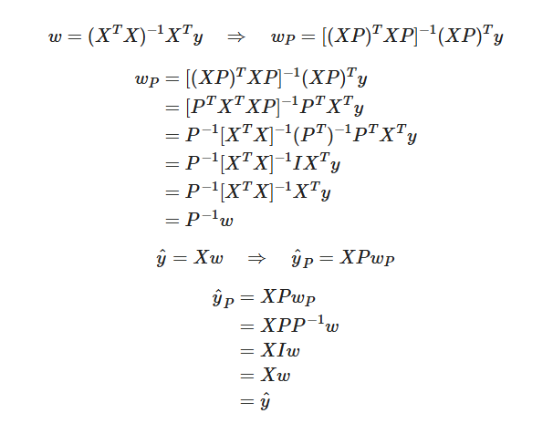
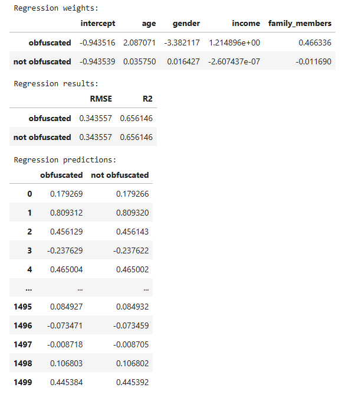

# Sprint 11 Project: Linear Algebra
 
---

### 📚 Table of Contents
- 🔍 [Project Overview](#project-overview)
- 📈 [Conclusion](#conclusion)
- 🖼️ [Sample Outputs](#sample-outputs)
- 📁 [Files](#files)

---

## Project Overview

The Sure Tomorrow insurance company wants to solve several tasks with the help of Machine Learning, and you are asked to evaluate that possibility.
- Task 1: Find customers who are similar to a given customer. This will help the company's agents with marketing.
- Task 2: Predict whether a new customer is likely to receive an insurance benefit. Can a trained prediction model do better than an untrained dummy model? Can it do worse? Explain your logic.
- Task 3: Predict the number of insurance benefits a new customer is likely to receive using a linear regression model.
- Task 4: Protect clients' personal data without breaking the model from the previous task.

It's necessary to develop a data transformation algorithm that would make it hard to recover personal information if the data fell into the wrong hands. This is called data masking, or data obfuscation. But the data should be protected in such a way that the quality of machine learning models doesn't suffer. You don't need to pick the best model, just prove that the algorithm works correctly.

---

## Conclusion

The goal of this project was to use machine learning to analyze the Sure Tomorrow insurance company's customers. It entailed four tasks: find customers similar to a given customer using k nearest neighbor (kNN) clustering, predict whether a new customer is likely to use any insurance benefits using a kNN classifier, predict the number of insurance benefits likely to be used by a new customer using linear regression, and protect personal client data during the linear regression task. The data were suitable for modeling, lacking any missing values, outliers, or obvious distributional issues.

To identify similar users, I employed a kNN algorithm with both scaled and unscaled data and both Euclidean and Manhattan distance metrics. Scaling affected the results because distance (between neighbors) depends on the scale of measurement. Features with larger numbers therefore have more influence on results than those with smaller numbers. Scaling ensures that every feature contributes equally to the distance measure. The distance metrics had some impact, but much less than scaling. Euclidean and Manhattan distances produced very similar lists of nearest neighbors, albeit sometimes with slightly different orders.

The classifier model I created from the kNN algorithm was very effective. The kNN classifier with k = 1 and scaled data performed best (F1 = 0.97), followed by the kNN classifier with k = 1 and unscaled data (F1 = 0.61). Both kNN models handily outperformed four random dummy models with various probabilities (0, 0.11, 0.5, and 1) of predicting insurance benefit use, which had uniformly poor scores (F1 = 0, 0.11, 0.17, and 0.21, respectively).

I created a linear regression model from scratch using linear algebra and it predicted the number of insurance benefits reasonably well (RMSE = 0.34, R2 = 0.66). Although the regression weights differed, the performance for scaled and unscaled data were identical because linear regression results are generally invariant to linear transformations.

To obfuscate customer data, I multiplied the features by a random invertible matrix before submitting them for linear regression. The original data could be recovered with the random matrix's inverse but not without it, protecting customer privacy. Obfuscation changed the regression weights, but not the predictions or the results of linear regression. I proved that both analytically and in practice.

In conclusion, machine learning offers several useful tools for analyzing the Sure Tomorrow insurance company's customer data. Given a prospective customer, it can find similar customers, predict whether they will use any insurance benefits, and predict how many insurance benefits they will likely use while protecting personal data.

---

## Sample Outputs

Here are two key moments from the analysis:

  
*Matrix derivation shows that predictions remain unchanged when the same transformation is applied to both the input data and model weights.*

 

  
*Obfuscated and original feature sets yield identical model weights, RMSE, and R² scores. This confirms that the transformation preserves predictive power.*

---

## Files

📄 See the full analysis in [`sprint-11-project.ipynb`](./sprint-11-project.ipynb)  
📄 Or view a static version in [`sprint-11-project.html`](./sprint-11-project.html)  
📄 Project background: [`project-description.md`](./project-description.md)

> Note: This project uses one CSV file, which is included in the `/data/` folder.  
> See [`/data/README.md`](./data/README.md) for details.
